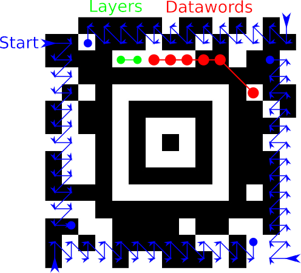

# Decoding
*Note: We assume every image to be free of errors, so that the topic of error-correction can be left to the encoding section.*

Steps of the Decoding Process:
1. Decode the mode message to get the number of layers and the number of data codewords.
2. Calculate the total amount of bits of the codewords and padding, depending on the amount of layers bits might need to be skipped at the beginning:
    * Compact: **(88 + 16\*L)\*L** with L=number of layers
    * Full: **(112 + 16\*L)\*L** with L=number of layers
3. Read all the bits for the previously obtained number of data codewords. The pattern for reading this bitstring is peculiar and best left to the examples below. Furthermore any stuffed bits (complementary bits that the encoder inserts if all but the last bit of a codeword are of the same value) need to be skipped. Even further a full Aztec symbol has a reference grid (alternating bits in every 16th row and column, centered on the bulls-eye) which also needs to be skipped.  

4. Once all the bits of the encoded data are collected, the translation process into the original data can finally start. The bits are ordered in big-endian and the decoder starts in the **Upper** mode of the following encoding table.

 Value | Upper | Lower | Mixed | Punctuation | Digit
---|---|---|---|---|---
 0 | P/S | P/S | P/S | FLG(n) | P/S
 1 | SP | SP | SP | CR | SP 
 2 | A | a | ^A | CR LF | 0 
 3 | B | b | ^B | .SP | 1 
 4 | C | c | ^C | ,SP | 2 
 5 | D | d | ^D | :SP | 3 
 6 | E | e | ^E | ! | 4 
 7 | F | f | ^F | " | 5
 8 | G | g | ^G | # | 6
 9 | H | h | ^H | $ | 7
 10 | I | i | ^I | % | 8
 11 | J | j | ^J | & | 9
 12 | K | k | ^K | ' | ,
 13 | L | l | ^L | ( | .
 14 | M | m | ^M | ) | U/L
 15 | N | n | ^[ | * | U/S
 16 | O | o | ^\ | + | 
 17 | P | p | ^] | , | 
 18 | Q | q | ^^ | - | 
 19 | R | r | ^_ | . | 
 20 | S | s | @ | / | 
 21 | T | t | \\ | : | 
 22 | U | u | ^ | ; | 
 23 | V | v | _ | < | 
 24 | W | w | ` | = | 
 25 | X | x | \| | > | 
 26 | Y | y | ~ | ? | 
 27 | Z | z | ^? | [ | 
 28 | L/L | U/S | L/L | ] | 
 29 | M/L | M/L | U/L | { | 
 30 | D/L | D/L | P/L | } | 
 31 | B/S | B/S | B/S | U/L |  

* SP: Space
* CR: Carriage return
* LF: Linefeed
* Any **x/S** with **x** being **U** or **P** shifts to the mode **Upper** or **Punctuation** for a **single** following character. 
* Any **x/L** with **x** being **U**, **L**, **M**, **P**, or **D** shifts to the mode **Upper**, **Lower**, **Mixed**, **Punctuation**, or **Digit** for **all** the following characters until another shift happens.
* **B/S** indicates a switch to 8-bit characters. Directly after it a 5-bit codeword encodes the number of 8-bit characters that will follow. If that codeword was non-zero, a 11-bit codeword follows that gives the number of following 8-bit characters less 31. The 8-bit characters with a value from 0-127 are interpreted as 'ASCII' characters, 128-255 are interpreted as 'Latin 1'.
* TODO: Mixed mode (less important atm)
* TODO: FLG(n) Info (less important atm)

### Example 1: Straightforward Decoding


### Example 2: Decoding Digits

The following Aztec symbol contains a sequence of digits, let's decode it:


We start by reading in the amount of layers. The layer bits are **0b00** which equals **0** in base-10, add 1 and we get **1** as number of layers. The symbol is compact and according to the formula **(88 + 16\*L)\*L** for the amount of bits, there are **104** bits to be read in the layers. Since 104 does not divide evenly by the 6-bit long codewords there are 2 padding bits in the beginning that need to be skipped.

Now we decode the number of datawords. Those bits are **0b000110** which equals **6** in base-10, add 1 and we get **7** as number of datawords.

Let's start reading in the 7 datawords (7\*6 = **42 bits**) from the top-left:
```
   11 11 00 01 10 10 00 10 10 11 00 11
11 00 01 00 11 01 01 11 11
```

Let's rearrange them to 6-bit datawords, so that possible stuffed bits and erasures are more easily seen:
```
111100 011010 001010 110011
110001 001101 011111
```
There are no stuffed bits to remove here. Therefore, the process of decoding can start, we start in the **Upper** mode and take 5 bits:
```
0b11110 = 30 => D/L (we latch to **Digit** mode and now expect 4-bit digit codewords)
0b0011 = 3 => 1
0b0100 = 4 => 2
0b0101 = 5 => 3
0b0110 = 6 => 4
0b0111 = 7 => 5
0b1000 = 8 => 6
0b1001 = 9 => 7
0b1010 = 10 => 8
```

The encoded data was: '12345678'.

### Example 3: Decoding 8-Bit Characters

The following Aztec symbol contains 8-bit characters, let's decode it:


We start by reading in the amount of layers. The layer bits are **0b01** which equals **1** in base-10, add 1 and we get **2** as number of layers. The symbol is compact and according to the formula **(88 + 16\*L)\*L** for the amount of bits, there are **240** bits to be read in the layers. Since 240 divides evenly by the 6-bit long codewords there are no padding bits in the beginning that need to be skipped.

Now we decode the number of datawords. Those bits are **0b001100** which equals **12** in base-10, add 1 and we get **13** as number of datawords.

Let's start reading in the 13 datawords (13\*6 = **68 bits**) from the top-left:
```
11 11 10 00 11 01 10 00 10 01 10 10 11 01 10 11 10
01 11 00 10 01 11 10 11 01 11 11 10 01 11 10 00 11
01 00 01 01 11
```

Let's rearrange them to 6-bit datawords, so that possible stuffed bits and erasures are more easily seen:
```
11111X 001101 100010 011010 110110 111001
110010 011110 110111 111001 111000 110100
010111
```

There are is a single stuffed bit to remove here in the first codeword (striked out with an X). Therefore, the process of decoding can start, we start in the **Upper** mode and take 5 bits:
```
0b11111 = 31 => B/S (shift to 8-bit characters coming soon)
0b00110 = 6 => six 8-bit characters are coming
0b11000100 = 196 => Ä (8-bit characters above 127 are interpreted as Latin-1)
0b11010110 = 214 => Ö
0b11011100 = 220 => Ü
0b11100100 = 228 => ä
0b11110110 = 246 => ö
0b11111100 = 252 => ü (six 8-bit characters have been read)
0b11110 = 30 => D/L (latch to digit mode, 4-bit codewords)
0b0011 = 3 => 1
0b0100 = 4 => 2
0b0101 = 5 => 3
```

The encoded data was: 'ÄÖÜäöü123'.
