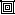
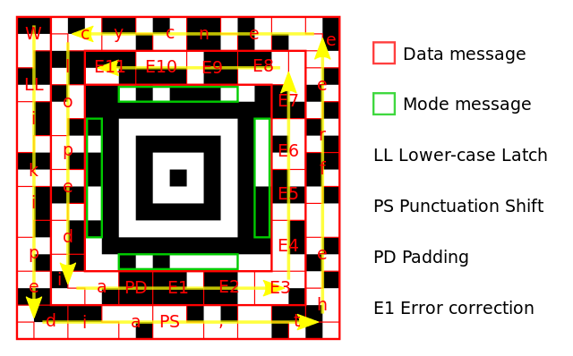

# General Information
The [Aztec code](https://en.wikipedia.org/wiki/Aztec_Code) is a two-dimensional barcode, similar to the more commonly known QR code. As most distinct feature it has a bulls-eye pattern of either **9x9 ('compact')** or **13x13 pixels ('full')** at the center. The corners of the core are used as orientation marks and the four lines of pixels between the corners store the **mode message**.

The mode message begins at the corner with three black pixels and travels around the bulls-eye pattern in a clockwise manner.

For the compact code, the following holds:
* The **first 2 bits** equal the number of layers minus one (**L-1**),
* the **following 6 bits** equal the number of data-containing codewords minus one (**D-1**),
* any of the remaining bits are for error correction.

For the full code, the following holds:
* The **first 5 bits** equal the number of layers minus one (**L-1**),
* the **following 11 bits** equal the number of data-containing codewords minus one (**D-1**),
* any of the remaining bits are for error correction.

The **codewords** are **6 to 12 bits** long (depending on the amount of layers) and reside in the outer layers. They begin at the top-left and spiral around the code in counter-clockwise manner up to the top-left of the mode message (see picture).

These codewords start with the actual encoded data and end with codewords for error-correction. There may also be bits for padding between the data and error-correction codewords.

## Sources and Further Reading
* [Wikipedia](https://en.wikipedia.org/wiki/Aztec_Code)
* [YouTube video by User 'Pillazo' with a Narrated Example](https://www.youtube.com/watch?v=xtlqYx6e1TE)